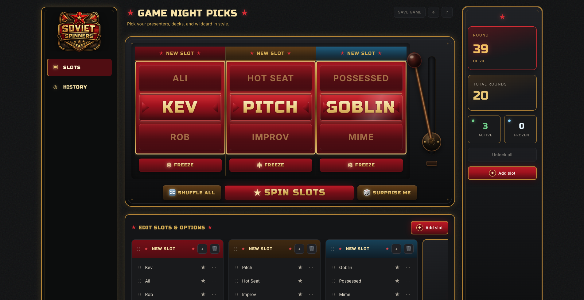
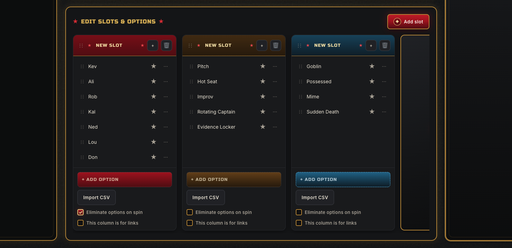

# Soviet Spinners


**Game Night Picks — a multi-slot randomizer with Soviet-industrial casino flair**

Spin up presenters, formats, wildcards, and more. Soviet Spinners is a client-only host console for running randomized game-night rounds — no accounts, no backend, no cost.

**Repository:** [github.com/official-mitchell/Soviet-Spinners](https://github.com/official-mitchell/Soviet-Spinners)

---

## Preview



*The main console: spin reels, freeze results, track rounds, and manage your session from one screen.*

---

## What you can do

Soviet Spinners turns "who goes next?" into a show. Configure one or more **slots** (columns), each with its own pool of options, then spin them like a slot machine.

| Capability | Description |
|------------|-------------|
| **Multi-slot spins** | Run multiple reels at once — e.g. *Presenter* + *Format* + *Wildcard* |
| **Freeze reels** | Lock a result you like while re-spinning the rest |
| **Shuffle & surprise** | Shuffle all pools, or let the machine pick a full random combo |
| **Round tracking** | Set a total round count and review completed spins in **History** |
| **Edit slots & options** | Add, rename, reorder, highlight, or delete entries inline |
| **CSV import** | Bulk-load options per slot from a spreadsheet |
| **Eliminate on spin** | Remove picked options from the pool so they can't repeat |
| **Links mode** | Turn a column into clickable URLs (great for decks or docs) |
| **Gated reveals** | Hide a slot's result behind a countdown launch screen until you're ready |
| **Local persistence** | Your session saves automatically in the browser — close the tab and come back |



---

## Who it's for

- **Game-night hosts** who want a fun, visual way to assign presenters, challenges, or roles
- **Teams running recurring formats** — pitch nights, hot-seat rounds, improv prompts, rotating captains
- **Anyone tired of "pick a name from a hat"** who wants something with a bit more theatre
- **Desktop users** — the layout is built for a wide host screen (1440px+); spin from a laptop hooked up to a TV or projector

You don't need to be technical. If you can edit a list and click a button, you can run a session.

---

## Why it's free

Soviet Spinners is **open source** under the [MIT License](./LICENSE). That means:

- **No subscription, no ads, no upsell** — use it as much as you want
- **No server costs passed to you** — everything runs in your browser; your data stays in `localStorage` on your machine
- **No API keys or sign-up** — clone the repo, open the page, and go
- **Fork it, remix it, share it** — the code is yours to adapt for your own game nights

It exists because randomized group activities are more fun when the reveal has some drama. Making that free and self-contained felt like the right call.

---

## How to use it

### 1. Get it running

**Requirements:** Node.js 18+ (only needed for the dev server and tests)

```bash
git clone https://github.com/official-mitchell/Soviet-Spinners.git
cd Soviet-Spinners
npm start
```

Open the URL shown in the terminal (typically `http://localhost:3000`).

No environment variables or API keys are required.

### 2. Set up your slots

1. Open the **Edit Slots & Options** section at the bottom of the main view.
2. Use the default columns or click **+ Add slot** to create your own (e.g. *Presenter*, *Format*, *Wildcard*).
3. Add options manually, or use **Import CSV** to paste in a list.
4. Optional per-column toggles:
   - **Eliminate options on spin** — picked items leave the pool
   - **This column is for links** — entries open as URLs when revealed

### 3. Run a round

1. Set **Total Rounds** in the right rail if you want a fixed session length.
2. Click **★ Spin Slots ★** (or pull the lever) to spin unfrozen reels.
3. Use **Freeze** on any reel to lock its result before the next spin.
4. Try **Shuffle All** to randomize every pool, or **Surprise Me** for a full random draw.
5. Switch to **History** in the sidebar to review past rounds.

### 4. Come back later

Your session is saved automatically. Reload the page and your slots, options, and history will still be there.

---

## Quick reference

| Action | Where |
|--------|-------|
| Spin | **★ Spin Slots ★** or the lever |
| Lock a reel | **Freeze** on that column |
| Unlock everything | **Unlock all** in the right rail |
| Review past spins | **History** tab in the sidebar |
| Bulk add options | **Import CSV** on any slot column |

---

## Development

Run the test suite:

```bash
npm test
```

### Project structure

```text
index.html          Host console entry point
launch.html         Gated-reveal countdown interstitial
css/                Design tokens and layout
src/data/           Session store, CSV import, spin logic, localStorage
src/ui/             Render layer, reels, spin controller, history
tests/              Node native unit & scenario tests
src/Soviet Spinners Logo.png   Brand mark
```

### Tech stack

- Vanilla HTML / CSS / JavaScript (ES modules)
- `localStorage` for session state
- Node built-in test runner (`node --test`)

---

## License

[MIT](./LICENSE) — Copyright (c) 2026 Mitchell Opatowsky

---

## Changelog

- **2026-08-06:** README refresh — added app previews (`Demo.png`, `Demo2.png`), usage guide, audience and licensing context; updated feature list to reflect shipped spin/history/reveal behavior.
- **2026-08-05:** Initial README; documents §1–§3 implementation (data layer, slot management UI, CSV import).
